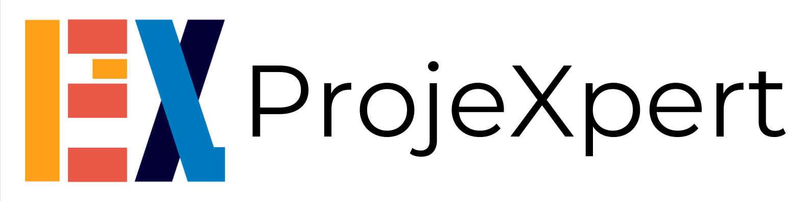
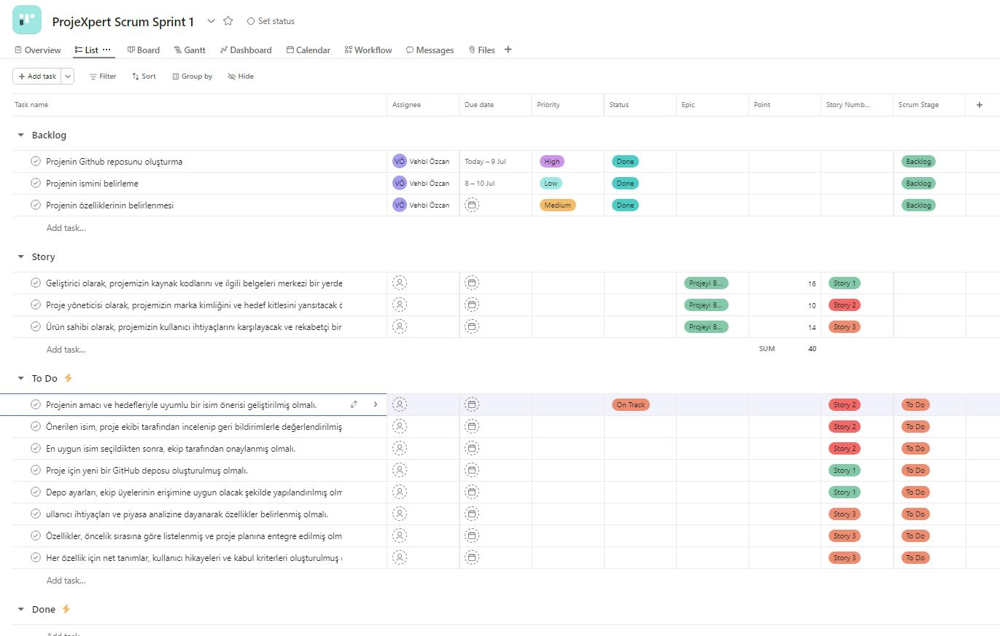
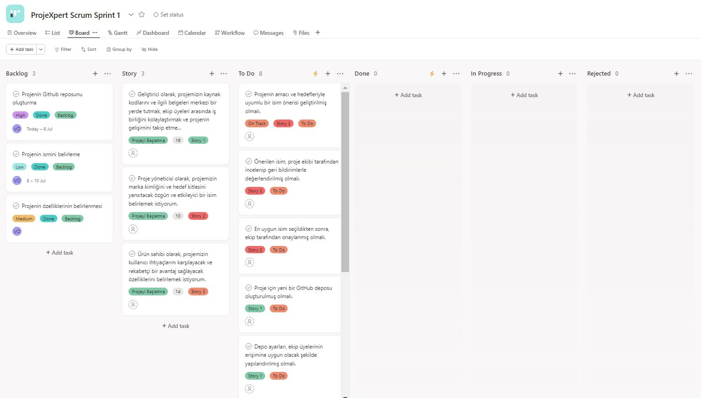
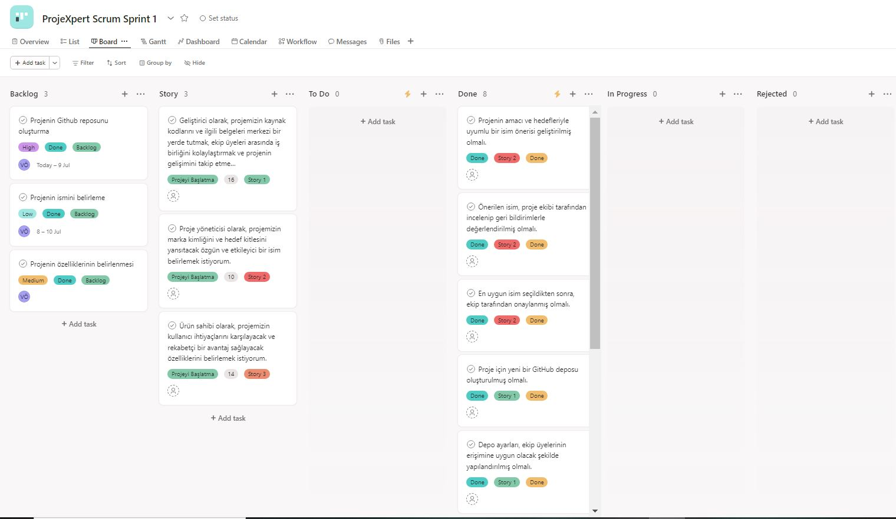

# ProjeXpert

 

# Takım İsmi
Flutter 97

 

# Takım Üyeleri

<table style=" width: 100%;
    border-collapse: separate;
    border-spacing: 0;
    border: 1px solid #333333;
    border-radius: 8px;
    overflow: hidden;">
  <thead>
    <tr>
      <th>İsim</th>
      <th>Görev</th>
      <th>İletişim</th>
    </tr>
  </thead>
  <tbody>
    <tr>
      <td>Vehbi Özcan</td>
      <td>Scrum Master</td>
      <td>
        
        
      </td>
    </tr>
    <tr>
      <td>Yusuf Alp Yıldız</td>
      <td>Product Owner</td>
      <td>
        
        
      </td>
    </tr>
    <tr>
      <td>Zeynep Ceyhan</td>
      <td>Developer</td>
      <td>
        
        
      </td>
    </tr>
    <tr>
      <td>Fazile Nisa Gazan</td>
      <td>Developer</td>
      <td>
        
      </td>
    </tr>
  </tbody>
</table>

 

# Proje İsmi
<b>ProjeXpert</b>

 

# Ürün Logosu

 

# Ürün Açıklaması

ProjeXpert, proje yönetimini modern bir seviyeye taşıyan yenilikçi bir uygulamadır. Yapay zeka teknolojisi ile güçlendirilmiş ProjeXpert, toplantı kayıtlarını analiz ederek otomatik olarak OKR, Proje Teslimatları, Proje Hedefleri, Proje Başlatma Belgeleri ve Sprint Planları gibi kritik proje yönetim belgelerini oluşturur. Bu sayede proje yöneticileri ve ekip üyeleri, stratejik hedeflerini belirlerken ve projelerini planlarken zamandan ve enerjiden tasarruf ederler. ProjeXpert, her adımda daha verimli, organize ve hedef odaklı çalışmanızı sağlar.

 

# Ürün Özellikleri
1. **Otomatik Belge Oluşturma:** Toplantı kayıtlarını analiz ederek OKR, proje başlatma belgeleri ve sprint planları gibi kritik belgeleri otomatik olarak oluşturur ve indirilebilir yapar.
2. **Yapay Zeka Entegrasyonu:** Yapay zeka destekli analiz ve dokümantasyon işlemleri ile zaman ve kaynak tasarrufu sağlar.
3. **Esnek ve Kullanıcı Dostu Arayüz:** Kullanıcıların ihtiyaçlarına göre özelleştirilebilen basit ve sezgisel arayüz.
4. **Özelleştirilebilir Raporlama:** Proje ilerlemesi, ekip performansı ve hedeflere ulaşma durumu hakkında detaylı ve özelleştirilebilir raporlar.

 

# Hedef Kitle
ProjeXpert, geniş bir kullanıcı kitlesine hitap eden esnek ve güçlü bir araçtır:
1. **Proje Yöneticileri:** Projelerini daha etkin bir şekilde planlamak ve yönetmek isteyen profesyoneller.
2. **Ekip Liderleri:** Ekip koordinasyonunu ve hedef belirlemeyi optimize etmek isteyen liderler.
3. **Girişimciler ve Startup Kurucuları:** İş fikirlerini hayata geçirirken süreçleri daha verimli yönetmek isteyen yenilikçi bireyler.
4. **Kurumsal Şirketler:** Büyük ölçekli projeleri koordine etmek ve yönetmek için çözümler arayan organizasyonlar.
5. **Serbest Çalışanlar ve Danışmanlar:** Müşteri projelerini daha profesyonel ve organize bir şekilde yönetmek isteyen bireyler.
6. **Eğitim Kurumları:** Proje yönetimi eğitimleri ve çalışmaları için örnek oluşturma arayışında olan akademik çevreler.

---

# Sprint 1

- **Sprint 1** için puan değerlendirmesi *40* olarak belirlenmiştir.
- **Puan tamamlama mantığı**: Proje boyunca tamamlanması gereken backlog puanı *260*'dır. İlk Sprint için bitirilmesi istenilen puan sayısı *40* olarak belirlenmiştir ve hedefe ulaşılmıştır.
- **Daily Scrum**: Slack üzerinden chat ve huddle ile görüşmeler sağlanmıştır.

- ## Sprint Board Ekran Görüntüleri (ASANA):

## Sprint Review: 
**Katılımcılar:**
- Vehbi Özcan (Scrum Master)
- Yusuf Alp Yıldız (Product Owner)

**Özet:**  
3 üyenin takım değişikliğinin yanı sıra takım üyelerinin iş ve sınav durumundan dolayı bu sprintte teknik olmayan ve sprint puanı nispeten düşük işler yapıldı.Sprint boyunca, takım ProjeXpert’in ismini belirledi. Uygulamaya eklenecek özellikler kararlaştırıldı. GitHub deposunu oluşturdu ve proje özelliklerini tanımladı. Önerilen isim ProjeXpert olarak kabul edildi ve GitHub deposu başarıyla oluşturuldu.  Diğer sprintlerde tasarım ve kodlama üzerine daha yoğun bir şekilde ilerleme yapılacağına karar verildi.

## Sprint Retrospective:
**Katılımcılar:**
- Vehbi Özcan (Scrum Master)
- Yusuf Alp Yıldız (Product Owner)

**Özet:**  
İsim belirleme, GitHub deposu oluşturma ve özellik tanımlama süreçleri genellikle başarılı bulundu. Ancak, iletişimde yaşanan bazı aksaklıklar ve iş birliği süreçlerinde iyileştirilmesi gereken noktalar tespit edildi. Bu konuların çözümü için belirlenen eylem planları, gelecek sprintlerde uygulanmak üzere kararlaştırıldı.

## Sprint Backlog URL:

<a href="https://app.asana.com/0/1207751422682466/1207751329431290" style="font-size:18px;display:flex; align-items:center;">Asana sprint backlog workspace bağlantısı</a>

---
